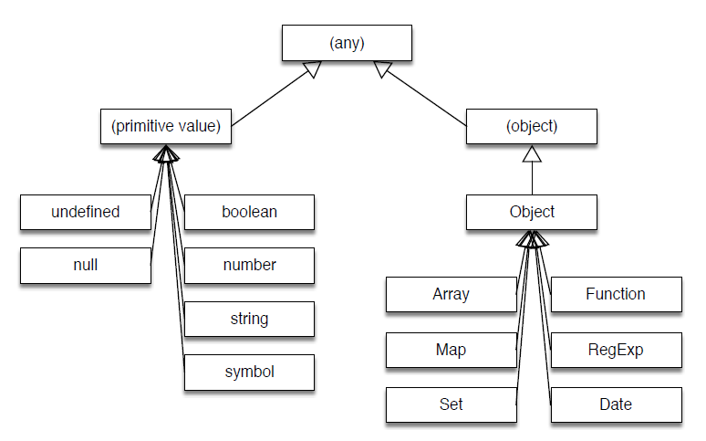

# Javascript's type hierarchy



- Primitive values (tipos de valor) = undefined, null, boolean, number, bigint, string, symbol.
- All other values (tipos de referência) = objects (functions, arrays, etc).
<hr/>

- ### String:

Can be declared with quotes, double-quotes or back ticks.

```js
const name = "Cida";
const middle = "Luna";
const last = `Gonçalves`;
```

- ### Number:

```js
let a = 10 + 10;  // addition
let b = 20 - 10;  // subtraction
let c = 10 * 10;  // multiplication
let d = 100 / 10; // division
let e = 1000 % 3; // modulo
```

- ### Object:

```js
var curso = new Object();
var curso = {
  título: "Javascript Formação Básica",
  instrutora: "Amanda Cavallaro",
  nível: "1",
  dataPublicacao: false,
  numeroVisualizacoes: 0,
};

console.log(curso);
```

Criando objeto a partir do construtor:
```js
function Curso2(titulo, instrutora, nivel, dataPublicacao, numeroVisualizacoes){
    this.titulo = titulo,
    this.instrutora = instrutora,
    this.nivel = nivel,
    this.dataPublicacao = dataPublicacao,
    this.numeroVisualizacoes = numeroVisualizacoes
  }
  
  var cursos = [
      new Curso2("HTML, CSS, JS, Angular, React", "Luna C", 1, false, 0),
      new Curso2("HTML, CSS, JS, Angular, React", "Luna C", 1, true, 454242352)
  ]
  console.log(cursos);
```

Utilizando o typeof para retorna o tipo da variável no JS:
```js
console.log(typeof(true));              // retorna boolean
console.log(typeof Boolean(true));      // boolean
console.log(typeof new Boolean(true));  // object - nao use Boolean como construtor
console.log(typeof 'Cida Luna');        // string
console.log(typeof 37);                 // number

var doze = new Number(12);     // criado a partir de um construtor do tipo primitivo
var quinze = doze + 3;
console.log(quinze);           // 15
console.log(typeof doze);      // retorna object 
console.log(typeof quinze);    // number
```

Tipo por valor:
```js
var x = 10;
var y = x;
x=20;
console.log(x,y);   // retorna 20,10
```

Tipo por referência, utilizando as propriedades de um objeto:
```js
var x = { valor: 10 };
var y = x;
x.valor = 20;
// x e y apontam para o mesmo endereço de memória
console.log(x);  // retorna 20
console.log(y);  // retorna 20
y.valor = 55;
console.log(x);  // retorna 55
console.log(y);  // retorna 55
```


Coerção:
```js
console.log('5'- 5);        // retorna 0
console.log('5' + 5);       // "55"
console.log(true + 1);      // 2
console.log(true + true);   // 2
console.log([] + {});       // "[object Object]"
console.log([] + []);       // ""
```

Implícito:
```js 
console.log(+'5');           // retorna 5
console.log(5 + '');         // "5"
console.log(1234 && 'olá');  // "olá"
console.log(null || true);   // true
```

Explícito:
```js 
console.log(Number('50'));   // retorna number 50
console.log(String(50));     // retorna string "50"
```

```js
//Public Integer somaNumeros(Integer a, Integer b){ return a + b; }
function somaNumeros(a,b) { return a + b; }
somaNumeros(5,3);        // retorna 8
somaNumeros(5,'abc');    // retorna "5abc"
```