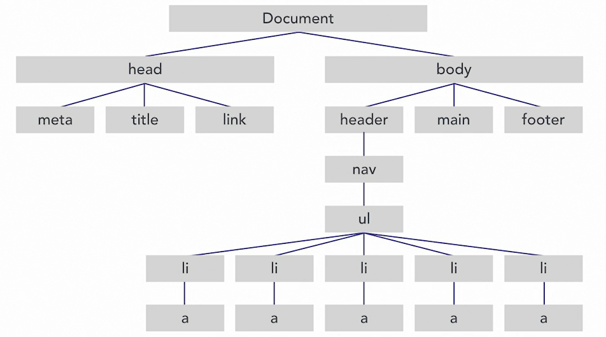

# BOM & DOM
## Browser Object Model - BOM
Modelo de objeto de Navegador - Janela

- Propriedades do BOM:
```js
window.innerWidth;  // verifica a largura da janela do navegador
window.navigator;   // verifica qual é o navegador e outras propriedades

```

- Métodos do BOM:
```js
window.alert("Olá");
```

## Document Object Model - DOM
Modelo de objeto do Documento - Documento dentro da janela
As tags do HTML são considerados como Nós do DOM.



- Propriedades do DOM:
```js
document.body;   // O elemento body
document.title;  // O título do documento
document.URL;    // A URL do documento
```

- Métodos do DOM:
```js
document.getElementById("id-btn");
document.getElementById("demo").innerHTML = 5 + 6; // imprime 11 no elemento do HTML que tiver o id demo
document.getElementsByClassName("nomeDaClasse");
document.getElementsByTagName("nomeDaTag");
document.querySelector(".main-nav a");
document.querySelectorAll("a");  // recupera todas as ancoras <a> no documento
```

- Métodos com propriedade do DOM:
```js
document.querySelector(".subtitle").innerHTML = "Um hotel em Marte?"; // altera a primeira instância do texto no documento
document.querySelector(".masthead").classList;  // retorna um array com os elementos encontrados por indice
document.querySelector(".masthead").classList.add("nova-classe"); // adiciona uma classe ao elemento
document.querySelector(".masthead").classList.remove("nova-classe"); // remove uma classe do elemento
document.querySelector(".nova-classe").classList.toggle("masthead"); // retorna true(adiciona) or false(remove)
const CTA = document.getElementById("ctaBtn");
if (CTA.hasAttribute("target")) {
    console.log(CTA.getAttribute("target"));
}else{
    CTA.setAttribute("target","_blank"); // adiciona o atribute que abre uma nova aba no navegador
}
console.log(CTA.attributes);

```

- Métodos de criação de elemento no DOM:
```js
.createElement();    // Cria um elemento
.createTextNode();   // Cria um nó de texto
.apppendChild();     // Coloca um nó filho dentro de outro
```


