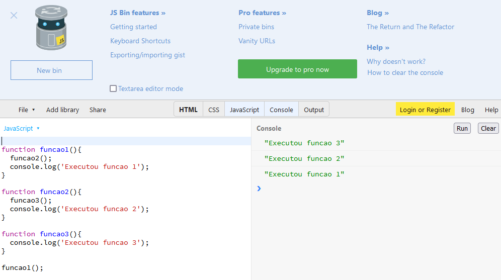

## 6. Pilha Stack LIFO
### LIFO (Last In First Out)

```js
// LIFO (Last In First Out) = O último que entrou é o primeiro a sair

function funcao1(){
    funcao2(); // primeiro executa a chamada da funcao2 depois apresenta a linha a seguir do console
    console.log('Executou a funcao 1');
}

function funcao2(){
    funcao3(); // chama a funcao3, executa ela, depois apresenta o console abaixo
    console.log('Executou a funcao 2');
}

function funcao3(){
    console.log('Executou a funcao 3');
}

funcao1();
```

