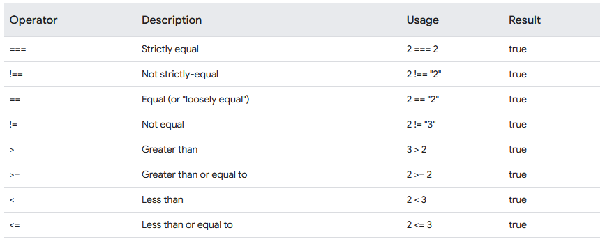

## 7. Comparison
### == equal to

```js
console.log(3 == '3');  // o JS retorna true
// 1º JS verifica se são do mesmo tipo
// null == undefined, se for, ele retorna true
// number == string, se for, ele converte a string em numero e volta ao primeiro passo
// boolean == number, se for, ele converte o boolean em numero
// boolean == string, se for, ele converte a string para boolean e volta no primeiro passo
// objeto == primitivo, se for, ele converte o objeto numa string.
```

### === equal value and equal type

```js
// === compara o valor e o tipo
console.log(3 === '3');  // o JS retorna false
```

### typeof utilizado para verificar o tipo de uma variável

```js
// typeof 
var year = 2024;
const name = "Cida Luna";
console.log(typeof(year));  // returns number
console.log(typeof(name));  // returns string
```


