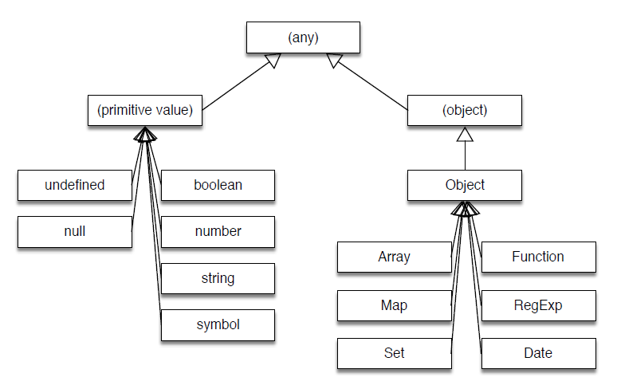
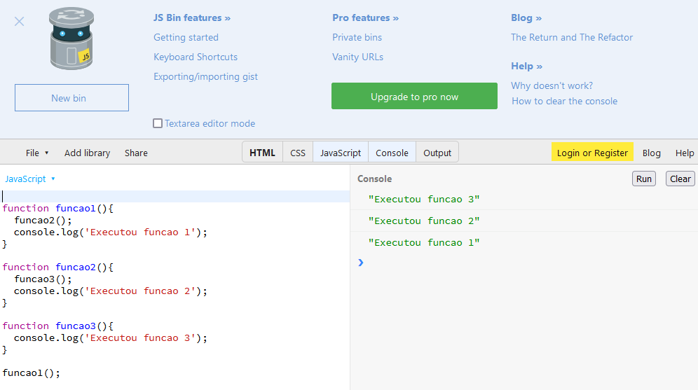
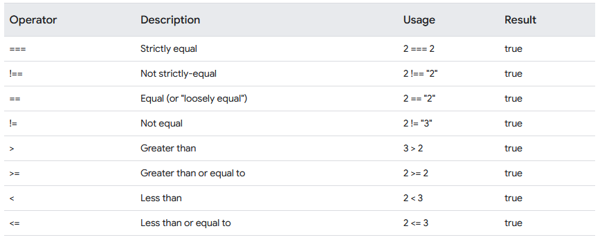

# Javascript Notes

Este repositório apresenta anotações sobre a linguagem Javascript (JS) na Web.
Será abordado conceitos básicos com a sintaxe e exemplos práticos para estudo.

<p align="center">
  
</p>

## 📚 <a id="table-of-contents">Conteúdo</a>

1. **[Intro](#1-intro)**
2. **[Variables](#2-variables)**
3. **[Types](#3-types)**
4. **[Closure](#4-closure)**
5. **[BOM-DOM](#5-BOM-DOM)**
6. **[Pilha-Stack-LIFO](#6-Pilha-Stack-LIFO)**
7. **[Comparison](#7-Comparison)**
8. **[Scope](#8-Scope)**
9. **[Expressions and Statements](#9-expressions-x-statements)**


## 1. Intro

-  [Intro](https://github.com/cidaluna/javascript-notes/blob/main/01-js-intro.md)

- Links:
- [Treinar Javascript no JSBin] (http://jsbin.com/?js,console)
- [MDN Learn Javascript] (https://developer.mozilla.org/pt-BR/docs/Learn/JavaScript)
- [Book Online] (https://exploringjs.com/js/book/index.html)


```html
<body>
  ...
  <script src="./myscript.js"></script>
</body>
```

```javascript
<script>console.log('Hello!!');</script>
```

### Books & References

- [MDN Docs Javascript](https://developer.mozilla.org/en-US/docs/Web/JavaScript)


**[⬆ Back to Top](#table-of-contents)**

---

## 2. Variables

-  [Variables](https://github.com/cidaluna/javascript-notes/blob/main/02-js-variables.md)

- **var** 
- **let**
- **const** (_value can NOT be updated_)

Keyword             |  var   | let   | const 
--------------------|--------|-------|------
Global Scope        |  ✅   |  ❌   |  ❌
Function Scope      |  ✅   |  ✅   |  ✅
Block Scope         |  ❌   |  ✅   |  ✅
Can Be Reassigned?  |  ✅   |  ✅   |  ❌
Can Be Redeclared?  |  ✅   |  ❌   |  ❌
Can Be Hoisted?     |  ✅   |  ❌   |  ❌


| Legenda     |
|-------------|
| ✅ - Yes    |
| ❌ - No     |


```js
var name = "Cida";
let age = 37;
const cool = true;
```

**[⬆ Back to Top](#table-of-contents)**

---

## 3. Types

-  [Types](https://github.com/cidaluna/javascript-notes/blob/main/03-js-types.md)



- Primitive values (tipos de valor) = undefined, null, boolean, number, bigint, string, symbol.
- All other values (tipos de referência) = objects (functions, arrays, etc).
<hr/>

- ### String:

Can be declared with quotes, double-quotes or back ticks.

```js
const name = "Cida";
const middle = "Luna";
const last = `Gonçalves`;
```

- ### Number:

```js
let a = 10 + 10;  // addition
let b = 20 - 10;  // subtraction
let c = 10 * 10;  // multiplication
let d = 100 / 10; // division
let e = 1000 % 3; // modulo
```

- ### Object:

```js
var curso = new Object();
var curso = {
  título: "Javascript Formação Básica",
  instrutora: "Amanda Cavallaro",
  nível: "1",
  dataPublicacao: false,
  numeroVisualizacoes: 0,
};

console.log(curso);
```

Criando objeto a partir do construtor:
```js
function Curso2(titulo, instrutora, nivel, dataPublicacao, numeroVisualizacoes){
    this.titulo = titulo,
    this.instrutora = instrutora,
    this.nivel = nivel,
    this.dataPublicacao = dataPublicacao,
    this.numeroVisualizacoes = numeroVisualizacoes
  }
  
  var cursos = [
      new Curso2("HTML, CSS, JS, Angular, React", "Luna C", 1, false, 0),
      new Curso2("HTML, CSS, JS, Angular, React", "Luna C", 1, true, 454242352)
  ]
  console.log(cursos);
```

Utilizando o typeof para retorna o tipo da variável no JS:
```js
console.log(typeof(true));              // retorna boolean
console.log(typeof Boolean(true));      // boolean
console.log(typeof new Boolean(true));  // object - nao use Boolean como construtor
console.log(typeof 'Cida Luna');        // string
console.log(typeof 37);                 // number

var doze = new Number(12);     // criado a partir de um construtor do tipo primitivo
var quinze = doze + 3;
console.log(quinze);           // 15
console.log(typeof doze);      // retorna object 
console.log(typeof quinze);    // number
```

Tipo por valor:
```js
var x = 10;
var y = x;
x=20;
console.log(x,y);   // retorna 20,10
```

Tipo por referência, utilizando as propriedades de um objeto:
```js
var x = { valor: 10 };
var y = x;
x.valor = 20;
// x e y apontam para o mesmo endereço de memória
console.log(x);  // retorna 20
console.log(y);  // retorna 20
y.valor = 55;
console.log(x);  // retorna 55
console.log(y);  // retorna 55
```


Coerção:
```js
console.log('5'- 5);        // retorna 0
console.log('5' + 5);       // "55"
console.log(true + 1);      // 2
console.log(true + true);   // 2
console.log([] + {});       // "[object Object]"
console.log([] + []);       // ""
```

Implícito:
```js 
console.log(+'5');           // retorna 5
console.log(5 + '');         // "5"
console.log(1234 && 'olá');  // "olá"
console.log(null || true);   // true
```

Explícito:
```js 
console.log(Number('50'));   // retorna number 50
console.log(String(50));     // retorna string "50"
```

```js
//Public Integer somaNumeros(Integer a, Integer b){ return a + b; }
function somaNumeros(a,b) { return a + b; }
somaNumeros(5,3);        // retorna 8
somaNumeros(5,'abc');    // retorna "5abc"
```

**[⬆ Back to Top](#table-of-contents)**

---

## 4. Closure

-  [Closure](https://github.com/cidaluna/javascript-notes/blob/main/04-js-closure.md)

Exemplo de Closure (fechamento). Onde a função interna depende da função externa para poder retornar o resultado.

```js
function fazerCalculo(){
    var a = 5;
    var b = 4;

    function multiplicarTermos(){
        var resultadoMultip = a * b;
        return resultadoMultip;
    }

    return multiplicarTermos;
}

var resultado = fazerCalculo();
console.log("O resultado: ", resultado);
```

### Books & References

- [You Don't Know JS Yet, 2nd Edition: Scope & Closures — Kyle Simpson](https://github.com/getify/You-Dont-Know-JS/tree/2nd-ed/scope-closures)

**[⬆ Back to Top](#table-of-contents)**

---

## 5. BOM DOM

-  [BOM-DOM](https://github.com/cidaluna/javascript-notes/blob/main/05-js-BOM-DOM.md)

## Browser Object Model - BOM
Modelo de objeto de Navegador - Janela

- Propriedades do BOM:
```js
window.innerWidth;  // verifica a largura da janela do navegador
window.navigator;   // verifica qual é o navegador e outras propriedades

```

- Métodos do BOM:
```js
window.alert("Olá");
```

## Document Object Model - DOM
Modelo de objeto do Documento - Documento dentro da janela
As tags do HTML são considerados como Nós do DOM.


- Propriedades do DOM:
```js
document.body;   // O elemento body
document.title;  // O título do documento
document.URL;    // A URL do documento
```

- Métodos do DOM:
```js
document.getElementById("id-btn");
document.getElementById("demo").innerHTML = 5 + 6; // imprime 11 no elemento do HTML que tiver o id demo
document.getElementsByClassName("nomeDaClasse");
document.getElementsByTagName("nomeDaTag");
document.querySelector(".main-nav a");
document.querySelectorAll("a");  // recupera todas as ancoras <a> no documento
```

- Métodos com propriedade do DOM:
```js
document.querySelector(".subtitle").innerHTML = "Um hotel em Marte?"; // altera a primeira instância do texto no documento
document.querySelector(".masthead").classList;  // retorna um array com os elementos encontrados por indice
document.querySelector(".masthead").classList.add("nova-classe"); // adiciona uma classe ao elemento
document.querySelector(".masthead").classList.remove("nova-classe"); // remove uma classe do elemento
document.querySelector(".nova-classe").classList.toggle("masthead"); // retorna true(adiciona) or false(remove)
const CTA = document.getElementById("ctaBtn");
if (CTA.hasAttribute("target")) {
    console.log(CTA.getAttribute("target"));
}else{
    CTA.setAttribute("target","_blank"); // adiciona o atribute que abre uma nova aba no navegador
}
console.log(CTA.attributes);

```

- Métodos de criação de elemento no DOM:
```js
.createElement();    // Cria um elemento
.createTextNode();   // Cria um nó de texto
.apppendChild();     // Coloca um nó filho dentro de outro
```

**[⬆ Back to Top](#table-of-contents)**

---

## 6. Pilha Stack LIFO
### LIFO (Last In First Out)

-  [Pilha Stack LIFO](https://github.com/cidaluna/javascript-notes/blob/main/06-js-pilha-LIFO.md)

```js
// LIFO (Last In First Out) = O último que entrou é o primeiro a sair

function funcao1(){
    funcao2(); // primeiro executa a chamada da funcao2 depois apresenta a linha a seguir do console
    console.log('Executou a funcao 1');
}

function funcao2(){
    funcao3(); // chama a funcao3, executa ela, depois apresenta o console abaixo
    console.log('Executou a funcao 2');
}

function funcao3(){
    console.log('Executou a funcao 3');
}

funcao1();
```



**[⬆ Back to Top](#table-of-contents)**

---

## 7. Comparison

-  [Comparison](https://github.com/cidaluna/javascript-notes/blob/main/07-js-comparisons.md)

### == equal to

```js
console.log(3 == '3');  // o JS retorna true
// 1º JS verifica se são do mesmo tipo
// null == undefined, se for, ele retorna true
// number == string, se for, ele converte a string em numero e volta ao primeiro passo
// boolean == number, se for, ele converte o boolean em numero
// boolean == string, se for, ele converte a string para boolean e volta no primeiro passo
// objeto == primitivo, se for, ele converte o objeto numa string.
```

### === equal value and equal type

```js
// === compara o valor e o tipo
console.log(3 === '3');  // o JS retorna false
```

### typeof utilizado para verificar o tipo de uma variável

```js
// typeof 
var year = 2024;
const name = "Cida Luna";
console.log(typeof(year));  // returns number
console.log(typeof(name));  // returns string
```



**[⬆ Back to Top](#table-of-contents)**

---

## 8. Scope

-  [Scope](https://github.com/cidaluna/javascript-notes/blob/main/08-js-scope.md)

### var, let, const

```js
// var pertence ao escopo onde foi declarado
// let e const pertencem somente ao escopo do bloco {}
var nome = "Luna";

function teste0(){
  var sobrenome = "Goncalves";
  if(sobrenome === "Goncalves"){
    const valor = 10;
  }
  console.log(valor);  // Error const valor is not defined here
}
teste0();
```

### LEXICO
Dentro de uma funcao eu posso utilizar a variavel nas funcoes aninhadas
```js
function teste1(){
  var variavel = "Meu nome";
    function teste2(){
        variavel = "Seu nome";
    }
}
teste1();
```

### GLOBAL
Quando começamos a escrever o código, já estamos no escopo global. Ao alterar uma variável global no escopo global, a mesma será alterada na aplicação toda.
```js
var a = 10;
function alterar(){
  a = 128;
}
console.log(a);
alterar();
console.log(a);
```

### FUNÇÃO
Igual o escopo léxico, o que é criado dentro da função não está disponível fora dela.

### BLOCO
```js
function bloco(){
  var teste;
  if(true){
    teste = 'var teste';  
    let teste2 = 'let teste2'; 
  }
  console.log(teste);  // returns var teste
  console.log(teste2); // error teste2 is not defined
}
bloco();
```

### HOISTING
```js
function bloco(){
  var teste;
  if(true){
    teste = 'var teste';  
    var teste2 = 'var teste2'; 
  }
  console.log(teste);  // returns var teste
  console.log(teste2); // returns var teste2
}
bloco();
```

**[⬆ Back to Top](#table-of-contents)**

---

## 9. Expressions x Statements

-  [Expressions and Statements](https://github.com/cidaluna/javascript-notes/blob/main/09-js-expressions-statements.md)

### Expressions
Expressões (Expressions) = devolvem um valor único. Como por exemplo: chamada de método, chamada de função, chamada de if ternário, etc. As expressões não podem existir por si mesmas, elas fazem parte de uma declaração.

```js
// Exemplo Expressões (Expressions) 
1+1      // produces 2
"Luna"   // produces "Luna"
true     // produces true
[1,2,3].pop()   // produces the number 3
num > 10        // produces either true or false
isAlive ? true : false // expression returns a boolean
(5+1)*2         // expressions can contain expressions
console.log(Math.random() + 5);       // produces a unique number
console.log(expressao());             // retorna um valor único é expressão
```

### Statements 
 Declarações/Instruções (Statements) = não devolvem um valor, são ações que servem de instrução para a tarefa, como por exemplo, while, for, if, else, function, etc.
 
```js
// Exemplo Declarações (Statements)
const name = "Cida Luna";
var nickname = "Luna";
let age = 37;
let f = function funcaoTeste(){};
for(){}
if(isAlive === 1){}
let alive = isAlive ? true : false // statement, complete task instruction
while(){}
function add(firstNumber, secondNumber){ return firstNumber + secondNumber}
function expressao(){ return 1 + 1; }
function teste2(){}
```
Caso queira saber se algo é uma expressão ou uma declaração, utilize o bom e velho console.log('seu código JS aqui') se o JS executar será uma expressão. Se receber um erro, pode ser uma declaração ou um código inválido.

### Expressions x Statements in React
 Dentro do bloco de return no JSX, só é permitido o uso de expressions.

 ```jsx
 // Exemplo React
 function App(){
    return(
        <div>
            <p>{1+1}</p>                {/* success - expression */}
            <p>{isAlive ? 1 : 0}</p>    {/* success - expression */}
            <p>{if(isAlive === 1){}}</p>  {/* error - fails - statement */}
        </div>
    )
 }
 ```

**[⬆ Back to Top](#table-of-contents)**

---

